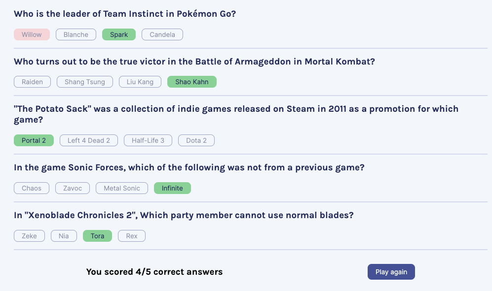

# Quizzical

Quizzical is a React web app, developed as a solo project for [Scrimba's Learn React Course](https://scrimba.com/learn/learnreact). It fetches 5 questions from Open Trivia Database API and utilizes a user-friendly interface inspired by the provided [Figma design](https://www.figma.com/file/E9S5iPcm10f0RIHK8mCqKL/Quizzical-App?type=design&node-id=0-1&t=fcniYUaEsuIJBcKQ-0). Users can choose answers and tally their score upon clicking "Check answers".

